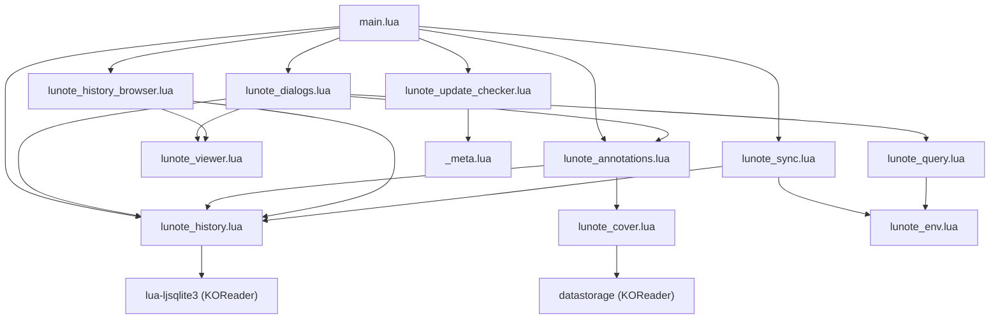
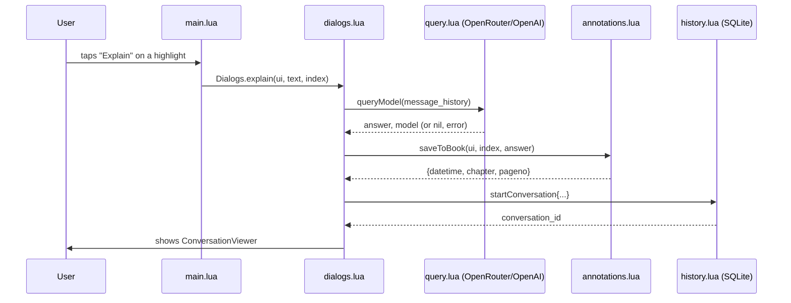
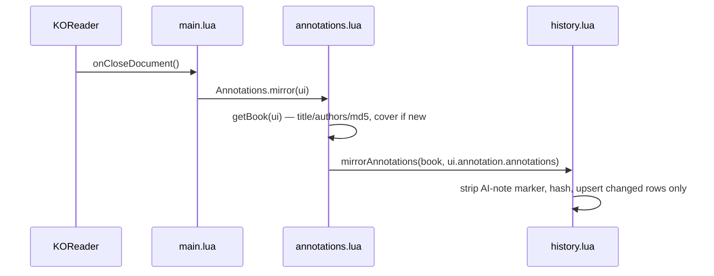
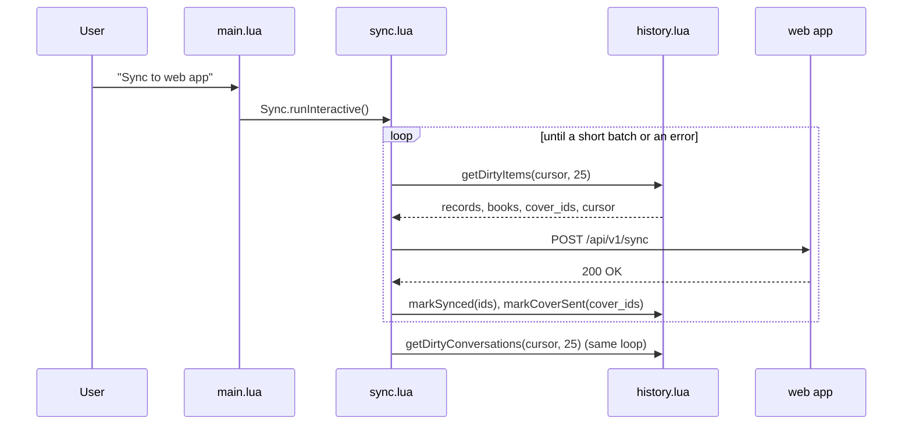

# Lunote (koreader-ai-plugin) — Architecture Audit

Scope: the plugin repository only (`main.lua` + `lunote_*.lua`), plus its test
suite (`test/`) and developer harness (`dev/`). The companion web app
(`koreader-ai-plugin-webapp`) is a separate repository and out of scope.

No application code was modified to produce this audit. See "Validation" at
the end for the commands run and their results.

## Executive summary

This is a small (~2,265 lines of Lua across 12 files), single-purpose
KOReader plugin with an unusually good foundation for its size: every I/O
boundary (HTTP, SQLite, filesystem) is wrapped so nothing can raise into
KOReader's unprotected event loop, the local store is schema-versioned and
keyset-paginated on purpose, and the test suite (103 assertions, 4 spec
files) specifically encodes the invariants the CLAUDE.md/AGENTS.md file
calls out. The architecture is a straightforward layered pipeline —
UI trigger → provider call → dual persistence (annotation + SQLite) → sync —
and the actual code matches that intended shape closely.

The problems found are not structural. They are: two small pieces of
config-loading boilerplate duplicated verbatim, one dialog living outside
the module whose job is dialogs, one piece of stale documentation (a file
table that predates a rename), three modules with no test coverage of their
own, and one pre-existing test failure caused by a developer's local `.env`
leaking into the test run. None of this calls for a rewrite or new layers —
the fixes are small, targeted, and listed with exact locations in
`docs/refactoring-plan.md`.

## Current architecture map

### Directories and their responsibilities

| Path | Responsibility |
| --- | --- |
| `/` (repo root) | The plugin itself — flat, one file per concern, no subpackages. This flatness is deliberate: KOReader loads a plugin as a directory of top-level `.lua` files (`require` resolves against the plugin dir), so nesting would only add `require("sub/lunote_x")` friction for no benefit at this size. |
| `test/` | Assertion-based specs run against a real (via `luasql-sqlite3`) SQLite backend, plus shared KOReader-widget stubs in `support.lua`. |
| `dev/` | An interactive terminal simulator (`kosim.lua`, driven by `run.lua`) that loads the plugin's real modules with only the widget layer stubbed, plus a Node stub sync server (`stub-server.mjs`) and a KOReader-emulator install helper. |
| `.github/workflows/` | One release workflow: run tests, zip the plugin, attach to a GitHub release on tag push. |

### Entry points

- **`main.lua`** — the KOReader plugin object (`InputContainer:new{name="lunote"}`). KOReader calls `:init()` on load, `:onCloseDocument()` when a book closes, `:addToMainMenu()` to populate the menu, and `:deletePluginSettings()` when the user disables+deletes the plugin. This is the only file KOReader itself calls into.
- **`test/run.sh`** — shell entry point for the automated suite (five `dofile`d spec scripts).
- **`dev/lunote-sim`** — shell entry point for the interactive simulator.

### Module dependency graph



Dependencies run one direction only: UI/orchestration (`main`, `dialogs`,
`browser`) → domain logic (`annotations`, `query`, `sync`) → storage
(`history`, `cover`, `env`). Nothing in `history.lua`, `cover.lua`, or
`env.lua` requires anything above it — there is no cycle in the graph.
`lunote_viewer.lua` is a leaf: a generic scrollable-text widget with no
knowledge of explanations, history, or sync (it is a close adaptation of
KOReader's own `TextViewer` widget).

### Major flows

**Explain (the core flow), from tap to storage:**



**Document close (mirror), decoupling sync from the filesystem:**



**Sync, batch by batch:**



### Where business logic lives

- **Provider/model selection and the HTTP call**: entirely in
  `lunote_query.lua`. `resolveProvider`/`resolveSettings` implement the
  documented precedence (`lunote_config.lua` > `.env` > provider default) in
  one place.
- **What "Explain" and "Translate" mean as conversations** (prompts, message
  history shape, what gets recorded and when): `lunote_dialogs.lua`.
- **What "saving an explanation" means to KOReader** (append vs. replace a
  note, the `— Lunote —` marker, turning a fresh selection into a real
  highlight): `lunote_annotations.lua`, with the marker constant itself
  owned by `lunote_history.lua` (`History.AI_NOTE_MARKER`,
  `History.stripAiNote`) because stripping is a storage-layer concern
  (mirroring) even though attaching is an annotation-layer concern.
- **Persistence rules** (schema, migration, dirty-flag/outbox semantics,
  uuid assignment): entirely in `lunote_history.lua`.
- **Sync protocol and batching**: entirely in `lunote_sync.lua`.

This is a reasonable split for the size of the codebase — there is no
"business logic hiding in a route/UI file" problem here, with one partial
exception noted below (the pairing dialog).

### Where state is owned

- **Per-book/per-highlight/per-conversation data**: SQLite
  (`lunote_history.sqlite3`), owned exclusively by `lunote_history.lua`.
  Every other module reaches it through `History.*` functions; nothing else
  opens a connection.
- **The book's own annotation state** (KOReader's native highlight/note
  data): owned by KOReader itself (`ui.annotation.annotations`);
  `lunote_annotations.lua` mutates it through the documented `AnnotationsModified`
  event rather than a private write path.
- **Device identity and sync credentials** (`device_uuid`, pairing `token`,
  `endpoint`, `last_sync_at`): the `sync_state` key/value table in the same
  SQLite database, accessed via `History.getState`/`History.setState`. This
  reuses the existing store rather than introducing a second persistence
  mechanism — a good decision given the size of the project.
- **In-memory-only UI state** (the current message history for a
  conversation, the update-checked-once flag): held as locals/closures in
  `lunote_dialogs.lua` and `main.lua` respectively. Nothing here needs to
  survive a restart, and nothing does.

### Frontend/backend communication

There is no frontend/backend split inside this repository — it is a
plugin that talks to two external HTTP services:

1. **The AI provider** (OpenRouter or OpenAI-compatible), one blocking POST
   per query, in `lunote_query.lua`.
2. **The Lunote web app's sync API** (`/api/v1/pair`, `/api/v1/sync`), in
   `lunote_sync.lua`.

Both use the same low-level pattern independently — `socket.http`/`ssl.https`
selection by URL scheme, `socketutil` timeouts, `ltn12` string source,
`json.encode`/`decode` with a `pcall` around each. This is a real, exact
duplication; see "Confirmed maintainability issues" below.

### Errors, validation, authentication, configuration

- **Errors**: uniform `return nil, message` on every I/O boundary
  (`lunote_query.lua`, `lunote_sync.lua`, `lunote_history.lua`'s
  `withConn`), surfaced to the user via `InfoMessage`. This is the
  project's central invariant (CLAUDE.md #1) and it is followed
  consistently — I did not find a counter-example.
- **Validation**: minimal by design — this plugin has one real "form" (the
  pairing-code dialog) and otherwise passes already-validated KOReader data
  (highlighted text, document props) through. There is no user-input
  validation gap that matters at this scope.
- **Authentication**: a bearer token obtained by exchanging a short pairing
  code (`Sync.pair`), stored in SQLite, sent as `Authorization: Bearer` on
  every sync POST. No token refresh, no expiry handling — reasonable for a
  device-to-server push model with no server-initiated calls back to the
  device.
- **Configuration**: three sources with one documented precedence order
  (`lunote_config.lua` > `.env` > built-in default), implemented correctly
  in `lunote_query.lua`. The *same* precedence idea is re-implemented
  independently for the `features` table in `lunote_dialogs.lua` — see
  duplication finding below.

### Tests

Five spec files run via `test/run.sh` against a real SQLite backend
(`luasql-sqlite3` behind a thin shim, `test/sq3shim.lua`) with KOReader's
widget layer stubbed in `test/support.lua`:

| Spec | What it covers |
| --- | --- |
| `history_spec.lua` | Schema/migration, mirroring + hashing, dirty-flag outbox, keyset pagination, note-marker stripping |
| `sync_spec.lua` | Pairing, batched push, partial-batch failure/retry, cover attach/detach |
| `explain_spec.lua` | The Explain/Translate flows end to end through the stubbed UI |
| `failures_spec.lua` | Every API failure mode (401/429/500, malformed body, transport failure, a raising socket call) never raises — CLAUDE.md invariant #1 |
| `update_spec.lua` | Version-comparison logic for the update checker |

A second, non-assertion harness (`dev/kosim.lua` + `dev/run.lua`) runs the
same real modules interactively for manual exploration, with its own,
independently-written set of KOReader stubs.

### Where actual architecture differs from the apparent intended architecture

1. **The documented file table is stale.** CLAUDE.md/AGENTS.md's "How it fits
   together" table names `main.lua`, `dialogs.lua`, `gpt_query.lua`,
   `annotations.lua`, `history.lua`, `sync.lua`, `env.lua` — but the actual
   files are `lunote_dialogs.lua`, `lunote_query.lua`, `lunote_annotations.lua`,
   `lunote_history.lua`, `lunote_sync.lua`, `lunote_env.lua`. Git history
   (`1dd286b Rename AskGPT to Lunote`) shows the files were prefixed during
   the AskGPT→Lunote rename and the table was never updated to match. This
   is documentation drift, not a code problem, but it actively misleads
   anyone (human or agent) who greps for `dialogs.lua` expecting it to
   exist. **Confirmed.**
2. **One dialog lives outside the dialogs module.** The plugin's stated
   module boundary — `lunote_dialogs.lua` owns "the Explain flow and the
   result viewer" (per the very table above) — is broken by
   `showPairingDialog()`, which is defined inline in `main.lua:79-114`
   rather than in `lunote_dialogs.lua` alongside the other user-facing
   dialogs. It is a fully self-contained `InputDialog` with its own button
   callbacks and has no dependency on anything else in `main.lua`.
   **Confirmed** — see refactoring plan Stage 4.

## Strengths of the existing codebase

- **The "nothing raises" invariant is real, not aspirational.** Every
  network call, every SQLite call, and the JSON encode/decode around them
  is wrapped in `pcall` and converted to `nil, message`, and
  `failures_spec.lua` specifically tests this against eight failure modes
  including a socket call that raises outright. This is the single most
  important property for a plugin running inside an unprotected event loop,
  and it is honored uniformly.
- **The sync design is well-matched to its actual constraints.** Keyset
  pagination (not `OFFSET`), stable `device:table:rowid` uuids for
  idempotent upserts, per-batch commit-then-mark-synced, and yielding to the
  UI between batches are all specifically chosen for "e-reader on bad wifi
  with little RAM" — and the code follows through on every one of those
  choices without shortcuts.
- **The local store correctly treats mirrored annotations as derived
  data.** `History.mirrorAnnotations` hashes each annotation's meaningful
  fields and only touches rows that actually changed, which keeps the
  dirty/outbox model correct without a naive "re-mark everything dirty on
  every close" approach.
- **Test-to-code ratio is healthy for the risk profile.** The riskiest
  paths (API failure handling, sync batching/retry, note-marker stripping)
  are exactly the ones with the most test coverage, rather than coverage
  being spread evenly regardless of risk.
- **The dev simulator is a genuine productivity investment**, not a toy: it
  loads the real plugin modules unmodified and persists real
  annotation/sidecar state between runs, so it catches real bugs (the
  `dev/README.md` explicitly notes it caught a note-marker bug the test
  suite missed) with an edit-test loop of seconds instead of a device copy.
- **Provider abstraction is proportionate.** `PROVIDERS`/`PROVIDER_ORDER` in
  `lunote_query.lua` is exactly as generic as it needs to be for "two
  OpenAI-compatible endpoints plus anything else the user points `base_url`
  at" — it is not an interface-per-provider abstraction for two providers.

## Confirmed maintainability issues

Each finding below cites exact locations and was verified by reading the
code, not inferred from naming.

### 1. Duplicated "load an optional Lua config module safely" boilerplate

`lunote_dialogs.lua:12-17` and `lunote_query.lua:20-26` each contain:

```lua
local CONFIGURATION = nil
local success, result = pcall(function() return require("lunote_config") end)
if success then
  CONFIGURATION = result
else
  print("lunote_config.lua not found, skipping...")
end
```

Byte-for-byte identical apart from variable reuse. `lunote_query.lua` has a
second, near-identical copy for the deprecated `api_key.lua`
(`lunote_query.lua:12-18`). Three copies of the same four-line pattern.
Low severity (four lines, no logic risk), but it means "how do we safely
load an optional user config file" is answered three times instead of
once, and a future change to that policy (e.g. warning the user once
instead of printing to a log no one sees) has three call sites to find and
update in lockstep.

### 2. `lunote_dialogs.lua` and `lunote_query.lua` both parse `lunote_config.lua` independently

Beyond the loading boilerplate above, the two modules maintain **separate
mental models of the same file**: `lunote_query.lua`'s `CONFIGURATION` holds
provider settings (`api_key`, `model`, `base_url`, `provider`); `lunote_dialogs.lua`'s
`CONFIGURATION` (via `getFeature`) holds `features.*`. Both are the same
table from the same `require`, read twice into two different local
bindings. This works today because `require` caches the module, so there is
no double-disk-read — but it means the two files can silently drift on
*how* they treat a missing/malformed config (they already do: `lunote_query.lua`
falls back through `Env.get`, `lunote_dialogs.lua`'s `getFeature` does not).
**Likely problem requiring verification**: whether this divergence is
intentional (features have no `.env` equivalent, so there is nothing to
fall back to) or accidental. Reading the code, it looks intentional — but
it is not stated anywhere, and a reader has to reconstruct that by
comparing both files.

### 3. Pairing dialog lives outside the dialogs module

As noted above (`main.lua:79-114`). This is a boundary violation against
the project's own stated module responsibilities, not a functional bug.
**Confirmed.**

### 4. Stale module-name table in CLAUDE.md/AGENTS.md

As noted above. **Confirmed.**

### 5. Duplicated low-level HTTP request pattern

`lunote_query.lua:117-175` and `lunote_sync.lua:51-90` each independently:
pick `http` vs `https` by URL scheme, call `socketutil:set_timeout`/`reset_timeout`
around a `pcall`-wrapped request, distinguish "the pcall itself failed" from
"the library returned `nil, code`" from "non-200 status," and
`pcall`-decode the JSON body. The two are not identical (different timeout
constants, different error-message shapes, `lunote_sync.lua` adds a bearer
token and reads `decoded.error` as a plain value where `lunote_query.lua`
reads `decoded.error.message` from a nested table, because the two APIs
shape errors differently) — so this is not a copy-paste-then-edit-nothing
duplication, it is two similar-but-legitimately-different implementations
of "make a JSON HTTP POST that never raises." **Likely problem requiring
verification**: whether unifying them into one small `lunote_http.lua`
helper is worth it. See "Alternatives considered" in the refactoring plan —
my assessment is this is *borderline*, not a clear win, because the two
error-shape differences are real API differences, not accidental
divergence, and forcing them through one helper risks becoming exactly the
kind of "abstraction for two callers with genuinely different needs" the
task brief asks me to avoid. I flag it rather than recommend it outright.

### 6. Deprecated `api_key.lua` fallback path

`lunote_query.lua:12-18` still loads a legacy `api_key.lua` module "IN A
LATER VERSION, THIS WILL BE REMOVED" (the comment's own words), and the
README documents it as deprecated in favor of `.env`/`lunote_config.lua`.
This is intentional, tracked technical debt rather than an oversight — not
a problem to silently clean up, but worth putting on the incremental plan
now that "a later version" has arrived (v1.2.2, per `_meta.lua`) and never
removed it. **Confirmed as intentional debt; candidate for removal is a
product decision, not a refactor** — flagged for human confirmation in the
final response.

## Probable issues requiring verification

- **`.agents/` and `skills-lock.json` at the repo root are untracked and
  unrelated to this project** — they are a Clerk-authentication skills
  bundle (SKILL.md files for clerk-nextjs-patterns, clerk-android, etc.)
  that has nothing to do with a KOReader plugin. This looks like tooling
  output that landed in the wrong working directory (e.g. an agent
  skill-installer run against this repo by mistake) rather than anything
  intentional. Not part of the application, but worth the user's attention
  since it is untracked and sitting in version control's blast radius.
  **Needs human confirmation** — I have not deleted or moved it.
- **`dev/kosim.lua` duplicates parts of `test/support.lua`'s KOReader-stub
  approach** (both define `Widget`/`InputContainer` prototypes and a table
  of stubbed `require`d modules). This is very likely intentional divergence
  — `test/support.lua` is optimized for fast, silent assertions;
  `dev/kosim.lua` renders to a console and persists state to disk between
  runs — but I have not traced every stub to confirm no accidental drift
  exists between what each one fakes for the *same* module (e.g. both stub
  `ui/widget/scrolltextwidget`; a real API change there would need updating
  in two places). Given the very different purposes of the two harnesses,
  I do **not** recommend merging them — flagged only so a human can confirm
  the divergence is acceptable, not as a refactor candidate.
- **The pre-existing `sync_spec.lua` failure** ("production endpoint uses
  TLS") is caused by this developer machine's `.env` containing a local
  `LUNOTE_SYNC_URL=http://192.168.1.137:3000` for testing against a local
  web app instance — `lunote_env.lua`'s `Env.get` reads the *real* `.env`
  next to the plugin because nothing in `test/support.lua` stubs it out.
  This is a **test-isolation gap**: the suite's correctness depends on the
  developer's local `.env` not setting `LUNOTE_SYNC_URL`, which is not
  documented anywhere and will surprise the next contributor. See Testing
  gaps below. I confirmed this by reading `.env` directly (git-ignored, not
  part of the repository) rather than modifying any code.

## Dependency and coupling concerns

- **No circular dependencies** were found in the module graph (see Mermaid
  diagram above) — confirmed by reading every `require` in every file.
- **`lunote_history.lua` is a wide dependency** (five other modules require
  it directly: `main`, `dialogs`, `annotations`, `sync`, `browser`), but this
  is appropriate coupling, not hidden coupling — it is the single owner of
  the one persistent store, and every caller goes through its public
  `History.*` functions rather than reaching into SQLite directly. This is
  the correct shape for a small plugin with one datastore; it would only
  become a problem if `history.lua` itself grew unrelated responsibilities
  (it has not — see file-size note below).
- **`lunote_history.lua` is the largest file (595 lines)** and does carry
  more than one responsibility — schema/migration, conversation CRUD,
  annotation mirroring, and the sync outbox queries are all in one file.
  This is a reasonable **cohesion** call (all four are "things done to the
  one SQLite database") rather than a size problem per se; splitting it
  would trade one 595-line file understandable end-to-end for three or four
  smaller files that all still need to agree on schema and the `withConn`
  helper. I do not recommend splitting it purely for size — see target
  architecture section for the one case (outbox-specific queries) where a
  split might pay for itself if the sync protocol grows.
- **Hidden coupling via the AI-note marker string.** `History.AI_NOTE_MARKER`
  and `History.stripAiNote` are owned by `lunote_history.lua`, but the
  *append* side of that contract lives in `lunote_annotations.lua`
  (`Annotations.saveToBook`, lines 69-73). The two sides agree today (both
  reference `History.AI_NOTE_MARKER`/`History.AI_NOTE_SEPARATOR` rather than
  hardcoding the string), so this is *not* a duplication bug — but it is a
  cross-module invariant (CLAUDE.md invariant #2) enforced only by shared
  constants and a comment, with no test asserting the two sides use the
  same constant rather than merely the same string value today. Worth a
  regression test rather than a code change — see refactoring plan Stage 2.

## Testing gaps

- **`lunote_cover.lua` has zero dedicated test coverage.** Its scaling math
  (`MAX_DIMENSION`/aspect-preserving scale), its temp-file cleanup on write
  failure, and its "no cover" (`nil`) paths are exercised only indirectly,
  if at all, since `test/support.lua` stubs `document:getCoverPageImage`
  nowhere. `sync_spec.lua` tests cover *transport* (attach/detach on the
  sync payload) but not cover *extraction*.
- **`lunote_history_browser.lua` has zero dedicated test coverage.** Its
  `truncate`/`formatDate` formatting helpers and its delete-conversation
  confirm flow are untested. Low risk (read-only UI over already-tested
  `History` functions) but the delete path is destructive and would benefit
  from at least one assertion that `ConfirmBox` → `ok_callback` actually
  calls `History.deleteConversation` with the right id.
- **`lunote_viewer.lua` (the `ConversationViewer` widget, 472 lines) has no
  dedicated spec.** It is exercised indirectly any time `explain_spec.lua`
  or `sync`-adjacent flows show a viewer, but nothing asserts on its own
  behavior (e.g. `askAnotherQuestion` wiring, `update()` rebuilding the
  widget). Given it is a close adaptation of KOReader's own well-tested
  `TextViewer`, this is lower priority than the two gaps above.
- **Test isolation**: as described above, `sync_spec.lua`'s TLS assertion is
  not hermetic against the developer's real `.env`. This is the one testing
  gap I'd rank above the missing-coverage items, because it produces a
  *false failure signal* today (as reproduced in Validation, below) rather
  than merely missing coverage.

## Security-sensitive areas

- **`lunote_query.lua` / `lunote_sync.lua`: API keys and bearer tokens in
  memory and over the wire.** Both are sent as `Authorization: Bearer ...`
  over HTTPS when the endpoint is `https://`; **`lunote_sync.lua`'s
  `endpoint()`, however, allows `http://` explicitly** — by design, so a
  developer can point `LUNOTE_SYNC_URL` at a local plaintext dev server
  (`sync_spec.lua`'s own "local HTTP endpoint stays supported" assertion
  confirms this is intentional). This means a *user* who sets
  `LUNOTE_SYNC_URL` to a non-TLS **production** endpoint would have their
  pairing exchange and every synced highlight/note sent in the clear, with
  no warning from the plugin. This is a legitimate dev/prod trade-off already
  made deliberately (per the test name "production endpoint uses TLS," the
  authors are aware TLS matters for production) — I flag it only because the
  plugin does not distinguish "you're pointing at localhost" from "you're
  pointing at some other host over plaintext HTTP" before sending
  credentials. **Needs human confirmation**: is a same-origin/localhost
  check worth adding, or is this an accepted risk for a self-hosted, opt-in
  feature? This is a product decision, not something to silently change.
- **`lunote_env.lua` reads `.env` from the plugin directory.** Correctly
  gitignored (`/.env` in `.gitignore`) and correctly out of the release zip
  (the GitHub Actions workflow copies only `*.lua` plus samples). No issue
  found.
- **`History.AI_NOTE_MARKER` stripping (`lunote_history.lua:100-107`)** is
  the mechanism that keeps AI-generated text from being mistakenly synced
  as user-authored content — this is explicitly called a project invariant
  (CLAUDE.md #2) precisely because getting it wrong has privacy/attribution
  consequences for what gets pushed to the user's account on the web app.
  It is covered by tests (`history_spec.lua`) for both note shapes described
  in the invariant.
- **The update checker (`lunote_update_checker.lua`) fetches from GitHub's
  API over HTTPS and only ever displays a version string in an
  `InfoMessage`** — no code execution, no auto-update. No issue found.

## Recommended target architecture

See `docs/proposed-structure.md` for the full directory-tree-level proposal.
In summary: **keep the current flat, one-file-per-concern layout.** The
codebase is small enough that introducing `src/`, `lib/`, or feature
subfolders would add navigation overhead (extra `require` path segments,
extra `package.path` entries in every stub file) without solving a real
problem — there is no file so large or so multi-purpose that splitting it
by directory would clarify anything a flat layout doesn't already show via
the `lunote_` prefix and the dependency graph above. The target changes are
all *within* the existing files/boundaries:

1. Fold the three copies of "load an optional module safely" (Issue #1)
   into one shared helper — small enough to live in `lunote_env.lua`
   (which already owns "read optional external configuration") rather than
   a new file.
2. Move `showPairingDialog` from `main.lua` into `lunote_dialogs.lua`
   (Issue #3), restoring the boundary the project's own documentation
   already claims exists.
3. Fix the stale file-name table in `CLAUDE.md`/`AGENTS.md` (Issue #4).
4. Add the missing tests identified above, starting with the test-isolation
   fix (stub `Env.get` or `LUNOTE_SYNC_URL` in `test/support.lua`) since
   that one produces an active false signal today.
5. Leave the HTTP-duplication question (Issue #5) and the `api_key.lua`
   removal (Issue #6) as explicitly flagged, not auto-applied — both need a
   human call, made in `docs/refactoring-plan.md`.

No provider abstraction, no ORM, no state-management library, and no
subprocess/microservice split is warranted at this size or growth rate.

## Validation

Commands run, from the repo root:

```sh
$ ./test/run.sh
history_spec.lua: 34 passed, 0 failed
sync_spec.lua: 36 passed, 1 failed  <-- FAILURES
  FAIL  production endpoint uses TLS  -> http
explain_spec.lua: 28 passed, 0 failed
failures_spec.lua: 10 passed, 0 failed
update_spec.lua: 5 passed, 0 failed
```

- **Test suite**: run as above. **One pre-existing failure**, traced to this
  machine's `.env` (`LUNOTE_SYNC_URL=http://192.168.1.137:3000`, git-ignored,
  not part of the repository) leaking into `sync_spec.lua` via
  `lunote_env.lua:Env.get`, which is not stubbed in `test/support.lua`. This
  is an environment/test-isolation issue documented above under "Probable
  issues" and "Testing gaps," not a regression introduced by this audit —
  no code was changed. Interpreter used: `luajit` (found on `PATH`; the
  script's own preference order also tried `lua5.1`/`lua51`, not present
  here).
- **Type checking**: not applicable. This is Lua 5.1/LuaJIT with no type
  annotations or type-checking tool (no `.luarc`, no Teal/EmmyLua config)
  configured anywhere in the repository.
- **Linting**: no linter configuration exists (no `.luacheckrc` or
  equivalent). Not run.
- **Production build**: the only "build" is the release workflow's zip
  packaging (`.github/workflows/release.yml`), which is not a compile step
  and was not run (it requires a git tag push and is CI-only). Its logic
  was read, not executed: install `luajit`/`lua-sql-sqlite3`, run
  `./test/run.sh`, copy `*.lua` plus the two sample config files and
  `LICENSE`/`README.md` into a `lunote.koplugin/` directory, zip it.
- **Git status check**: confirmed via `git status` before and after this
  audit — the three files shown as modified (`lunote_annotations.lua`,
  `lunote_history.lua`, `lunote_sync.lua`) and the untracked
  `lunote_cover.lua`/`.agents/`/`skills-lock.json` were already in that
  state at the start of this session (see the session's initial git status)
  and were not touched by this audit. No application code was written to
  or edited by the commands above.
